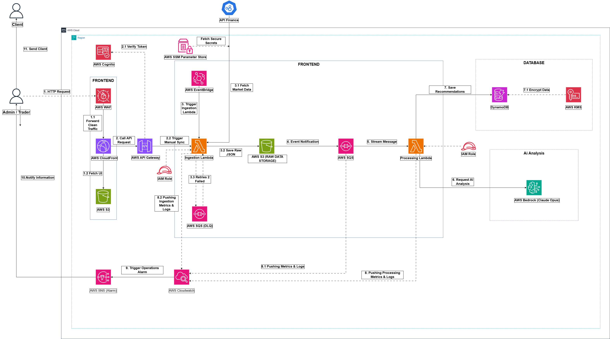

# PROJECT PROPOSAL

## AWS Stock Analyzer

---

## 1. Student Information

| Information | Details |
|---|---|
| Full Name | Le Tuan Kiet |
| Student ID | 2280601627 |
| Major | Information Systems |
| Internship Topic | AWS Cloud Computing |
| Final Project | AWS Stock Analyzer |
| Project Role | QA Tester |

---

## 2. Executive Summary

This project proposes building **AWS Stock Analyzer**, a web-based stock analysis and alert system using AWS cloud services.

The system is designed to help users enter a stock symbol, retrieve stock-related information, process basic analysis, and display the result through a web interface.
The backend logic of the project is mainly implemented using **Node.js** with AWS Lambda serverless functions.
The project is mainly used for academic and internship purposes. It helps the team understand how frontend, backend, data processing, and AWS cloud services can work together in a simple application.

In this project, my role is **QA Tester**. My responsibility is to support the team by testing the main functions of the application, including frontend behavior, backend API response, input validation, and frontend-backend integration.

---

## 3. Problem Statement

Stock information can be difficult to review manually because users often need to check many types of information such as price, volume, market movement, and technical signals.

Manual checking can take time and may miss important information. A simple stock analyzer system can help organize stock-related information and make the review process easier.

However, this project is not designed as a professional financial trading system. It is an internship project used to practice AWS Cloud Computing, web application structure, and basic QA testing.

---

## 4. Proposed Solution

The proposed solution is to build a simple cloud-based stock analysis application.

The basic workflow is described as follows:

1. The user enters or selects a stock symbol on the web interface.
2. The frontend sends the request to the backend API through Amazon API Gateway.
3. The backend receives and processes the request using AWS Lambda functions written mainly in Node.js.
4. Stock-related data is retrieved from Yahoo Finance API.
5. The backend processes the data and stores or returns the analysis result.
6. The frontend displays the result to the user through the dashboard.

The system is expected to include:

- A simple web interface.
- A stock symbol input field.
- Backend API for receiving user requests.
- Data processing logic for stock-related information.
- Result display area.
- Basic error handling for invalid input.
  
---

## 5. Solution Architecture

The AWS Stock Analyzer project follows a basic cloud application architecture.

The main components include:

| Component | Description |
|---|---|
| Frontend | Provides the user interface for entering stock symbols and viewing results |
| Backend API | Receives requests from the frontend and returns responses |
| Data Processing | Uses Node.js-based AWS Lambda functions to handle stock-related logic and prepare analysis results |
| Database / Storage | Stores stock data, analysis results, or system records if needed |
| AWS Cloud Services | Support hosting, API communication, storage, processing, and monitoring |
| QA Testing | Checks whether the application works correctly from the user perspective |

---

## 6. AWS Services Used

The project architecture may involve the following AWS services:

| AWS Service | Purpose |
|---|---|
| Amazon S3 | Store static frontend files and raw stock data |
| Amazon CloudFront | Distribute frontend content to users |
| AWS WAF | Help protect the frontend from common web attacks |
| Amazon Cognito | Support user authentication and login |
| Amazon API Gateway | Provide API endpoints for frontend-backend communication |
| AWS Lambda | Run Node.js serverless functions for ingestion, processing, and backend logic |
| Amazon SQS | Support asynchronous message queue processing |
| Amazon DynamoDB | Store processed stock analysis data |
| AWS KMS | Support encryption and data protection |
| Amazon Bedrock | Support AI-based stock analysis |
| Amazon CloudWatch | Monitor logs, errors, and system behavior |
| Yahoo Finance API | Provide stock market data source |

The actual implementation depends on the final project scope and team setup.

---

## 7. My Role in the Project

My role in this project is **QA Tester**.

My main responsibilities include:

- Understanding project requirements.
- Preparing basic manual test cases.
- Testing frontend interface behavior.
- Testing valid and invalid stock symbol inputs.
- Checking backend response behavior.
- Checking frontend-backend integration.
- Recording testing observations.
- Giving feedback to the team.

My work focuses on checking whether the application works correctly from the user perspective.

I do not claim that I independently deployed the whole AWS infrastructure. My contribution is mainly related to testing and project review.

---

## 8. Testing Scope

The testing scope includes the following areas:

| Testing Area | Description |
|---|---|
| Frontend Testing | Check layout, buttons, input fields, and result display |
| Input Validation Testing | Check valid input, empty input, and invalid stock symbols |
| Backend API Testing | Observe request and response behavior |
| Integration Testing | Check whether frontend and backend work together properly |
| Usability Checking | Check whether the application is understandable for users |

The testing method is mainly **manual testing**.

---

## 9. Expected Outcomes

After completing the project, the expected outcomes are:

- A basic AWS-related web application named **AWS Stock Analyzer**.
- A clearer understanding of cloud-based application structure.
- Basic experience in frontend, backend, and cloud service interaction.
- Manual testing notes for the final project report.
- Better understanding of the QA Tester role in a software project.

---

## 10. Project Limitations

This project has some limitations:

- The system is an academic internship project, not a commercial stock trading platform.
- The testing process is mainly manual and basic.
- Some AWS services are studied and applied at a beginner level.
- My role focuses on QA testing, not full system deployment.
- The project may not include advanced security, automation testing, or production-level monitoring.

---

## 11. Conclusion

The AWS Stock Analyzer project helps me connect AWS Cloud Computing knowledge with a practical project.

Through this project, I can understand how a simple cloud-based application is structured and how QA testing supports software development.

As a QA Tester, I focus on checking the application, testing basic user flows, and recording issues honestly. This matches my actual role and learning experience during the internship.
