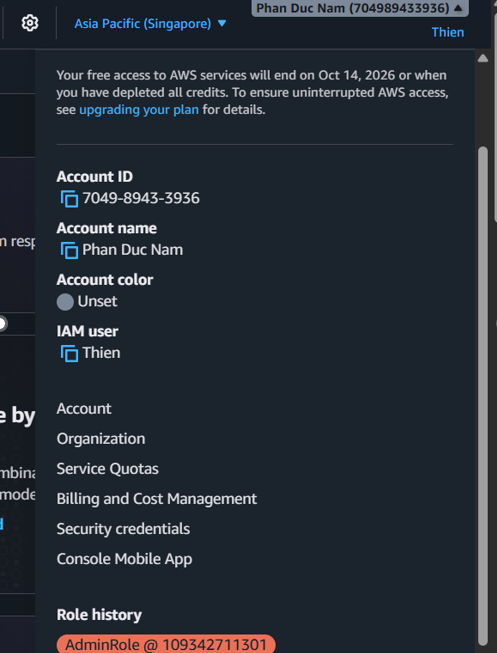
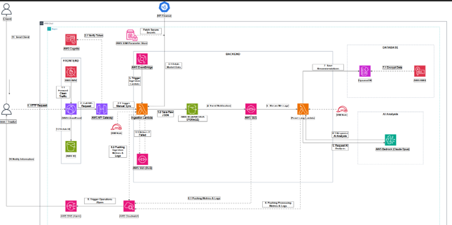

# 5.2 PREREQUISITE

## Deployment Preparation

---

## 1. AWS Account

An AWS account was required to access the AWS Management Console and create the cloud services used in the project.

The project was deployed in the AWS Singapore region.

---

## 2. System Architecture Diagram

Before deployment, the team prepared the system architecture diagram to understand how AWS services were connected.

The architecture showed the flow from user request, frontend, backend processing, data storage, AI analysis, and dashboard result display.

---

## 3. Data Source: Yahoo Finance API

Yahoo Finance was used as the main market data source of the system.

The system used Yahoo Finance to collect stock data such as:

- Open price
- High price
- Low price
- Close price
- Trading volume
- Historical price data by timeframe

This data was then processed by the backend for technical indicator calculation.

---

## 4. Backend Deployment Preparation

The backend required several AWS services.

### 4.1 Amazon S3 for Raw Data

Amazon S3 was used to store raw stock data collected from Yahoo Finance.

Bucket example: `production-stock-raw-data-finance`

Raw data storage is useful because it allows the system to check the original input data and reprocess data when needed.

---

### 4.2 Amazon SQS

Amazon SQS was used as a message queue between Ingestion Lambda and Processing Lambda.

Queue examples:

- `stock-processing-queue`
- `stock-processing-dlq`

SQS helps the system process data asynchronously. When Ingestion Lambda finishes collecting data, it sends a message to SQS. Processing Lambda then receives the message and continues the analysis process.

---

### 4.3 AWS Lambda

Two main Lambda functions were prepared:

- `production-stock-ingestion`
- `production-stock-processing`

The Lambda functions used Node.js 22.x.

The **Ingestion Lambda** receives stock analysis requests, calls Yahoo Finance, normalizes stock data, stores raw data in S3, and sends a message to SQS.

The **Processing Lambda** reads messages from SQS, retrieves stock data from S3, calculates technical indicators such as RSI, MACD, MA20, MA50, and Volume, then sends processed data to Amazon Bedrock for AI analysis.

---

## 5. Database Deployment Preparation

### 5.1 AWS KMS

AWS KMS was used to encrypt stored data.

KMS helps protect analysis data at rest and improves the security of the system.

---

### 5.2 Amazon DynamoDB

Amazon DynamoDB was used to store final stock analysis results.

Example table: `Stock_reports_1`

DynamoDB stores information such as:

- Stock symbol
- Timeframe
- Technical indicators
- AI recommendation
- Confidence score
- Analysis reason
- Trader approval status

The dashboard reads data from DynamoDB to display analysis results.

---

## 6. Frontend Deployment Preparation

### 6.1 Amazon S3 for Frontend Hosting

Amazon S3 was also used to host frontend static files.

Example bucket: `stock-frontend-finance`

The frontend files include HTML, CSS, JavaScript, and other static resources.

This approach helps reduce cost because the system does not need to run a web server continuously.

---

### 6.2 Amazon CloudFront

Amazon CloudFront was used as a CDN to distribute the frontend dashboard.

CloudFront helps improve loading speed and supports HTTPS access.

The deployed application link:

https://d3k9qj467czrvg.cloudfront.net/

---

### 6.3 AWS WAF

AWS WAF was used in front of CloudFront to protect the web application.

WAF can help filter or block common web attacks such as:

- SQL Injection
- Cross-Site Scripting
- Bot requests
- Abnormal request patterns

---

## 7. Authentication and API

### 7.1 Amazon Cognito

Amazon Cognito was used for user authentication.

Only valid users, such as traders or administrators, can log in to the dashboard and view analysis reports.

---

### 7.2 API Gateway

Amazon API Gateway was used as the connection layer between frontend and backend.

When users interact with the dashboard, the frontend sends requests to API Gateway. API Gateway then forwards the requests to the related Lambda functions.

---

## 8. Amazon Bedrock

Amazon Bedrock was used to support AI-based stock analysis.

In this project, Bedrock does not directly collect stock data or news. It receives calculated technical indicators such as RSI, MACD, MA, and stock price data, then generates analysis and recommendations.

Examples of recommendation results include:

- Strong Buy
- Strong Sell
- Watch

Bedrock also supports confidence scores and analysis reasons.

---

## 9. Summary

This prerequisite section helped prepare the AWS services needed for the AWS Stock Analyzer project.

The prepared services included S3, SQS, Lambda, DynamoDB, KMS, CloudFront, WAF, Cognito, API Gateway, and Amazon Bedrock.

These services supported the main project flow from data collection to backend processing, AI-supported analysis, dashboard display, and user authentication.
