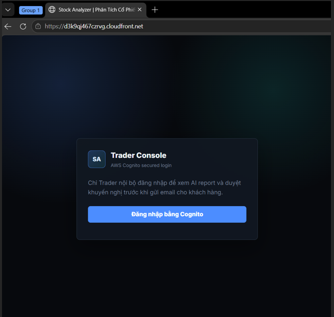

# 5.4.1 LOGIN AND DASHBOARD CHECKING

## Cognito Login and Initial Dashboard Review

---

## 1. Overview

This section describes the first testing step of the **AWS Stock Analyzer** application.

The purpose of this step was to access the deployed application, check the login page, log in through Amazon Cognito, and review whether the dashboard could display stock information correctly.

In this step, I tested the system from the user perspective as a **QA Tester**.

---

## 2. Accessing the Application

The application was accessed through the deployed CloudFront URL:

https://d3k9qj467czrvg.cloudfront.net/

The browser displayed the application page with the title:

**Stock Analyzer | Phân Tích Cổ Phiếu Thông Minh**

The login page showed a **Trader Console** screen and a button for Cognito login.

---

## 3. Cognito Login

The system used **Amazon Cognito** for authentication.

Since an internal user account was already available, the login process could be completed successfully.

Checked items:

- The application URL could be opened.
- The Cognito login button was displayed.
- The internal user could log in.
- The dashboard was displayed after successful login.

---

## 4. Initial Dashboard Checking

After logging in, I checked the main dashboard.

At the beginning, the dashboard displayed only the stock symbol **FPT**.

The checked items included:

- Dashboard layout
- Sidebar menu
- Market summary section
- Stock analysis table
- Available stock symbol
- Result display area

The dashboard was readable and could show stock-related information.

---

## 5. Testing Observation

The login and dashboard loading process worked successfully.

The system allowed the internal user to access the dashboard, and the dashboard displayed the available stock data.

At this stage, the dashboard only had limited stock data, so further testing was needed by submitting another stock symbol for analysis.

---

## 6. Result

| Test Item | Expected Result | Status |
|---|---|---|
| Open CloudFront URL | Application opens normally | Passed |
| Cognito login button | Login button is displayed | Passed |
| User login | Internal user can log in | Passed |
| Dashboard display | Dashboard loads after login | Passed |
| Initial stock data | FPT stock data is displayed | Passed |

---

## 7. Conclusion

The login and initial dashboard checking step was completed successfully.

This confirmed that the deployed application could be accessed through CloudFront, the Cognito login flow worked, and the dashboard could display initial stock information.
