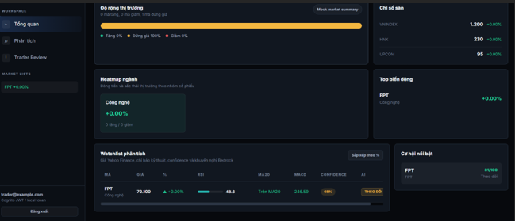

# 5.4.2 Stock Analysis Request

## Overview

After logging in successfully, I continued testing the stock analysis function on the dashboard.

In this step, my role was mainly as a **QA Tester**. I focused on checking whether the user interface allowed a user to select another stock code and send an analysis request correctly.

The dashboard initially displayed stock information for **FPT**. After that, I selected another stock symbol, **VNM**, to verify the analysis flow.

---

## Testing Objective

The objective of this test was to verify that:

- The dashboard could display the analysis section correctly.
- A user could select or enter another stock symbol.
- The system could receive the stock analysis request.
- The frontend could show the response after clicking the analysis button.

---

## Testing Steps

The testing process was performed manually with the following steps:

1. Logged in to the system using the test account.
2. Opened the dashboard page.
3. Observed that the dashboard initially showed stock data for **FPT**.
4. Opened the stock analysis section.
5. Selected the stock symbol **VNM** for analysis.
6. Selected the timeframe if the option was available.
7. Clicked the **Analyze** button.
8. Observed the response displayed on the dashboard.

---

## Testing Evidence

The following image shows the stock analysis request on the dashboard.

---

## Expected Result

The expected result was that the system should:

- Accept the selected stock symbol.
- Send the analysis request to the backend.
- Process the selected stock data.
- Return the analysis result to the dashboard.

---

## Actual Result

The system allowed me to select **VNM** and submit the analysis request from the dashboard.

The frontend was able to trigger the request and display the returned result. This confirmed that the basic interaction between the dashboard and the analysis function was working.

---

## QA Tester Notes

From the testing perspective, this step helped confirm that the stock analysis feature could be used from the user interface.

However, this test only focused on the manual checking of the request flow from the frontend. The detailed backend flow, including Lambda, S3, SQS, DynamoDB, and CloudWatch logs, is checked in the next section.
