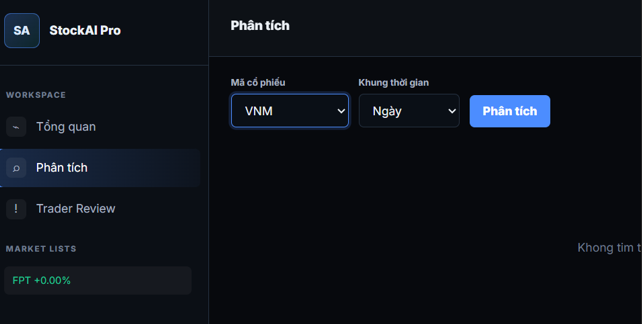

# 5.4.3 Backend Flow, S3, SQS, DynamoDB and CloudWatch Logs

## Overview

After submitting the stock analysis request from the dashboard, I continued checking the backend processing flow of the **AWS Stock Analyzer** project.

In this step, I did not focus on deploying the full AWS infrastructure. My role was to verify the system behavior from the perspective of a **QA Tester** by checking whether the request flow followed the expected backend architecture.

The expected flow was:

**Frontend → API Gateway → Lambda Ingestion → Yahoo Finance API → S3 → SQS → Lambda Processing → DynamoDB → Dashboard**

---

## Testing Objective

The objective of this test was to verify that the backend services worked together correctly after a stock analysis request was submitted.

The main points checked were:

- Whether the request was sent from the frontend.
- Whether the ingestion process could call the data source.
- Whether raw stock data was stored in Amazon S3.
- Whether the message was sent through Amazon SQS.
- Whether the processing Lambda handled the data.
- Whether processed data was saved to DynamoDB.
- Whether logs could be reviewed in CloudWatch.

---

## Backend Processing Flow

When I submitted the analysis request for **VNM**, the backend was expected to process the request through several AWS services.

First, the ingestion Lambda function called the **Yahoo Finance API** to retrieve stock data. After that, the raw stock data was stored in **Amazon S3**.

Next, a message was sent to **Amazon SQS** so that the processing step could be handled asynchronously. The processing Lambda then received the message, processed the stock data, and saved the result into **Amazon DynamoDB**.

Finally, the dashboard displayed the processed result to the user.

---

## CloudWatch Logs Checking

To verify the backend process, I checked the related logs in **Amazon CloudWatch**.

CloudWatch logs were useful for checking:

- Whether the Lambda function was triggered.
- Whether the stock symbol request was received.
- Whether the Yahoo Finance API call was executed.
- Whether the data processing step completed.
- Whether there were any errors during backend execution.

---

## Testing Evidence

The following image shows the backend flow checking and related log/error information.

---

## Expected Result

The expected result was that the system should:

- Receive the stock analysis request successfully.
- Retrieve stock data from Yahoo Finance API.
- Store raw data in S3.
- Send processing messages through SQS.
- Save processed results in DynamoDB.
- Display the result on the dashboard.
- Record useful logs in CloudWatch for debugging.

---

## Actual Result

The backend flow was triggered after submitting the stock analysis request.

Based on the checking process, the request could go through the main backend components, including Lambda, S3, SQS, DynamoDB, and CloudWatch logs.

However, there was an issue related to the AI analysis step using Amazon Bedrock. This issue is explained in the next section.

---

## QA Tester Notes

From the QA testing perspective, this step helped confirm that the backend processing flow was mostly working as expected.

CloudWatch logs were important because they helped identify where the system worked correctly and where an error occurred. In this case, the main issue was not from the basic stock data flow, but from the Bedrock quota limitation during the AI analysis step.
